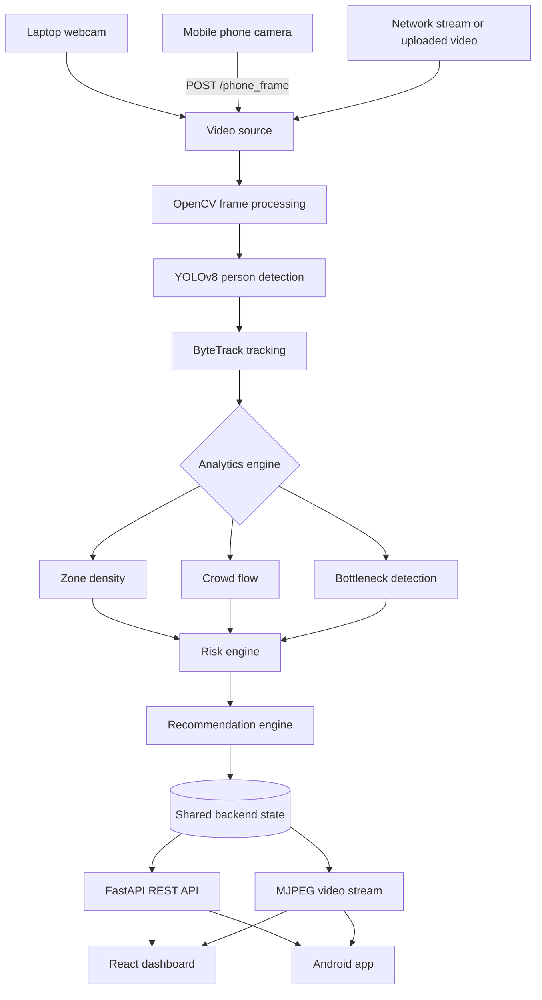

# 🛡️ CrowdShield AI

**Real-time AI-powered crowd surveillance and safety-management system.**

[](https://react.dev/)
[](https://www.typescriptlang.org/)
[](https://fastapi.tiangolo.com/)
[](https://ultralytics.com/)
[](https://capacitorjs.com/)

---

## 🚨 Problem statement

Large gatherings such as concerts, stadiums, stations, festivals, and religious events can develop dangerous congestion, bottlenecks, and crowd-crush risks. Manual CCTV monitoring is often reactive and difficult to scale.

CrowdShield AI automatically analyzes live video to help operators see crowd density, movement, bottlenecks, risk, and recommended actions in real time.

## 💡 Solution overview

The tracking pipeline uses **YOLOv8** person detection and **ByteTrack** multi-object tracking. It accepts laptop webcams, mobile-phone camera frames, network streams, and uploaded videos.

For every processed frame, the system:

1. Detects and tracks people.
2. Divides the view into zones A–D and calculates density.
3. Analyzes movement direction and potential bottlenecks.
4. Calculates a risk level: `LOW`, `MEDIUM`, `HIGH`, or `CRITICAL`.
5. Generates crowd-management recommendations.
6. Publishes telemetry and an annotated MJPEG stream to the web and Android clients.

## 🏗️ Architecture



### Phone-camera flow

The phone and the computer running FastAPI must be on the same LAN. The Android/WebView camera captures JPEG frames and posts them to the backend; the tracker switches to phone mode and the annotated result is available at `/video_feed`.

```text
Phone camera → JPEG frame → POST /phone_frame → FastAPI → YOLOv8 + ByteTrack
             → crowd analytics → annotated frame → GET /video_feed → web / Android UI
```

## 🛠️ Tech stack

| Area | Technologies |
|---|---|
| Backend | Python, FastAPI, Uvicorn, OpenCV, NumPy, Ultralytics YOLOv8, ByteTrack |
| Frontend | React 19, TypeScript, Vite, Tailwind CSS, Axios, React Router, Recharts |
| Mobile | Capacitor 8, Android, Android Camera API through the WebView |

## ✨ Features

- Real-time person detection, bounding boxes, confidence, and persistent tracking IDs.
- Four-zone (A–D) crowd-density analysis.
- Crowd-flow categories: `UP`, `DOWN`, `LEFT`, `RIGHT`, and `STATIONARY`.
- Bottleneck detection, dynamic risk classification, and actionable recommendations.
- Annotated MJPEG video feed at `GET /video_feed`.
- Laptop, phone, network/IP stream, and uploaded-video sources.
- LAN-ready backend for Android or another device on the same network.

## 📡 API endpoints

The FastAPI service runs on port `8000`.

| Method | Endpoint | Description |
|---|---|---|
| `GET` | `/` | Backend health check |
| `GET` | `/status` | Full crowd status and active source |
| `GET` | `/risk` | Current risk, people count, and highest-density zone |
| `GET` | `/zones` | Zone-density information |
| `GET` | `/flow` | Crowd movement information |
| `GET` | `/recommendations` | Current recommendations |
| `GET` | `/bottleneck` | Bottleneck information |
| `GET` | `/video_feed` | Processed MJPEG video stream |
| `POST` | `/phone_frame` | Receives a mobile-camera JPEG file as `file` |
| `POST` | `/set_source` | Changes the video source (`{ "source": "phone" }`, `"0"`, RTSP URL, etc.) |
| `POST` | `/upload_video` | Uploads and starts processing a supported video file |

## 🖥️ Frontend pages

- **Dashboard**: people count, risk, highest-density zone, bottleneck status, live feed, zones, flow, and recommendations.
- **Monitoring**: live stream, source controls, upload/network-source controls, and phone-camera controls.
- **Analytics**: people-count timeline, zone distribution, and crowd-flow charts.
- **Settings**: density thresholds and refresh-interval controls.

## 📂 Project structure

```text
CrowdShield_AI/
├── app.py                      # Uvicorn entry point
├── backend/
│   ├── api.py                  # FastAPI routes, including /phone_frame
│   ├── state.py                # Shared in-memory state
│   ├── streamer.py             # MJPEG streaming
│   └── tracker_service.py      # Tracking-thread lifecycle
├── detection/
│   ├── detector.py             # YOLOv8 detection and tracking
│   └── person_detector.py
├── tracking/tracker.py         # Tracking and analytics pipeline
├── analytics/                  # Density, flow, and bottleneck modules
├── prediction/risk_engine.py   # Risk evaluation
├── recommendation/recommender.py
├── datasets/videos/            # Local videos and uploads (ignored by Git)
├── frontend/
│   ├── android/                # Capacitor Android project
│   ├── src/
│   └── capacitor.config.ts
└── .gitignore
```

## 🚀 Installation and startup

### Prerequisites

- Python 3.11+
- Node.js 18+ and npm
- Android Studio / Android SDK (for APK builds)
- Git

### Backend

```bash
git clone https://github.com/DebasishAchary/CrowdShield_AI.git
cd CrowdShield_AI
python -m venv venv
```

Activate the environment:

- Windows: `./venv/Scripts/Activate.ps1`
- macOS/Linux: `source venv/bin/activate`

Install the dependencies:

```bash
pip install fastapi uvicorn opencv-python numpy ultralytics python-multipart
```

Start FastAPI from the repository root:

```bash
python -m uvicorn backend.api:app --host 0.0.0.0 --port 8000
```

For local testing, open `http://localhost:8000`. A healthy backend returns:

```json
{
  "message": "CrowdShield AI Backend Running",
  "status": "online"
}
```

`python app.py` is also supported as a convenience entry point.

### Frontend

```bash
cd frontend
npm install
npm run dev
```

Before using another device or building Android, set the computer's LAN address in both of these files:

- `frontend/src/config/config.ts`
- `frontend/src/components/monitoring/PhoneCamera.tsx`

For example:

```ts
const BACKEND_URL = 'http://<YOUR-LAPTOP-IP>:8000';
```

Find the IPv4 address with `ipconfig` on Windows or `ifconfig` on macOS/Linux. Build the production web bundle with:

```bash
npm run build
```

### Android (Capacitor)

From `frontend/` after building the web bundle:

```bash
npx cap sync android
cd android
./gradlew.bat assembleDebug
```

The debug APK is written to:

```text
frontend/android/app/build/outputs/apk/debug/app-debug.apk
```

To install it over ADB:

```bash
adb devices
adb install -r "./app/build/outputs/apk/debug/app-debug.apk"
```

The Android manifest includes `INTERNET` and `CAMERA` permissions, and cleartext LAN HTTP is enabled for the development backend.

### Using the phone as a camera

1. Connect the phone and laptop to the same Wi-Fi/LAN.
2. Configure the laptop IP as described above.
3. Start the backend with `--host 0.0.0.0`.
4. Build, sync, and install the Android app.
5. In **Monitoring**, start **Phone Camera** and grant camera permission.

The app sends a JPEG approximately every 500 ms to `/phone_frame`; the backend returns the processed result through `/video_feed`.

## 🎥 Supported video sources

| Source | Value |
|---|---|
| Laptop webcam | `0` |
| Second webcam | `1` |
| Mobile phone | `phone` |
| Network camera | e.g. `rtsp://<camera-ip>:554/stream` |
| Uploaded video | `.mp4`, `.avi`, `.mov`, `.mkv`, `.webm`, `.mpeg`, `.mpg` |

## 🧪 Quick checks

```bash
curl.exe http://localhost:8000/
curl.exe http://localhost:8000/status
curl.exe http://localhost:8000/risk
curl.exe http://localhost:8000/zones
curl.exe http://localhost:8000/flow
```

## 🛠️ Troubleshooting

### Backend or phone cannot connect

- Confirm the phone and computer use the same network.
- Check the configured `BACKEND_URL` in both frontend files.
- Run FastAPI with `--host 0.0.0.0`.
- Allow Python/Uvicorn through Windows Firewall if prompted.
- On the phone, open `http://<YOUR-LAPTOP-IP>:8000`; it should show the health-check JSON.

### Camera permission or phone frames fail

- Enable the Android camera permission for CrowdShield AI.
- Confirm the backend is reachable before starting the phone camera.
- Ensure the phone camera preview is active and the backend is receiving `POST /phone_frame` requests.

### YOLOv8 does not detect people

- Ensure the YOLO model is available locally or can be downloaded by Ultralytics.
- Make sure people are visible and the video is clear.
- Check the backend terminal for detector or tracker errors.

## 🔐 Ignored files

The repository ignores environment-specific and large/generated files, including:

- `venv/`, `__pycache__/`, and `*.pyc`
- `frontend/node_modules/` and `frontend/dist/`
- `.env`, `.env.*`, `.vscode/`, and `*.log`
- `datasets/videos/` and `models/*.pt`

Video datasets and model weights are therefore not included in Git by default.

## 🔮 Future improvements

- Multi-camera command center
- Database-backed historical analytics
- WebSocket telemetry and alerting
- Crowd heatmaps and advanced crowd-specific models
- Push notifications, incident reporting, and edge deployment

## 👨‍💻 Team

Built with ❤️ for the Hackathon by **Debasish Achary & Team**.

## 📄 License

MIT License
