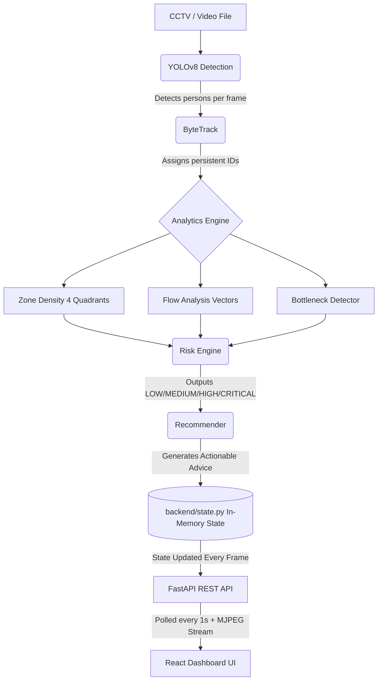

# 🛡️ CrowdShield AI

**Real-time AI-powered crowd surveillance and safety management system.**

[](https://reactjs.org/)
[](https://www.typescriptlang.org/)
[](https://fastapi.tiangolo.com/)
[](https://ultralytics.com/)
[](https://www.python.org/)
[](https://opensource.org/licenses/MIT)

---

## 🚨 Problem Statement

Large public gatherings — concerts, stadiums, railway stations, festivals — are prone to crowd crushes, stampedes, and bottlenecks that can result in casualties. Traditional CCTV monitoring relies heavily on manual observation, which is slow, error-prone, and reactive rather than proactive. 

**CrowdShield AI** provides an automated, proactive, AI-driven solution to monitor crowd dynamics in real time and prevent disasters before they happen.

---

## 💡 Solution Overview

CrowdShield AI processes live CCTV video feeds using **YOLOv8** (object detection) and **ByteTrack** (multi-object tracking) to detect, count, and track people in real time. 

The system automatically:
1. Divides the camera view into 4 quadrant zones (A, B, C, D).
2. Analyzes crowd density, flow direction, and bottleneck formation.
3. Computes a dynamic risk level (**LOW / MEDIUM / HIGH / CRITICAL**).
4. Generates actionable AI recommendations for crowd control officers.

All telemetry and recommendations are streamed to a modern, glassmorphism-styled React dashboard, updating every second.

---

## 🏗️ System Architecture



---

## 🛠️ Tech Stack

### **Backend (Python)**
*   **FastAPI**: High-performance REST API and MJPEG video streaming.
*   **Uvicorn**: ASGI server (binds to `0.0.0.0:8000` for LAN access).
*   **OpenCV (cv2)**: Video capture, frame processing, and on-the-fly annotation.
*   **Ultralytics YOLOv8**: State-of-the-art person detection (`yolov8n.pt`).
*   **ByteTrack**: Robust multi-object tracking with persistent IDs.
*   **Threading**: Background tracker thread decoupled from the API for smooth performance.

### **Frontend (React)**
*   **React 18 + TypeScript**: Built with Vite for lightning-fast HMR.
*   **TailwindCSS**: Dark theme, modern glassmorphism styling.
*   **Framer Motion**: Smooth micro-animations and transitions.
*   **Recharts**: Real-time AreaChart (timeline), BarChart (flow), PieChart (zones).
*   **Axios**: HTTP polling with a 1000ms heartbeat.
*   **React Hot Toast**: Live, unobtrusive alert notifications.
*   **Lucide React**: Clean, modern iconography.

---

## ✨ Key Features

*   ✅ **Real-time Detection & Tracking**: Unique IDs assigned to every individual.
*   ✅ **4-Zone Spatial Density Analysis**: Automatically monitors distinct sectors (A, B, C, D).
*   ✅ **Directional Crowd Flow**: Tracks 5 vectors (UP, DOWN, LEFT, RIGHT, STATIONARY).
*   ✅ **Automated Bottleneck Detection**: Identifies congestion zones instantly.
*   ✅ **Dynamic Risk Classification**: 4-level scale (LOW, MEDIUM, HIGH, CRITICAL).
*   ✅ **AI-Generated Recommendations**: Actionable crowd control tactics based on live data.
*   ✅ **Live MJPEG Video Feed**: Fully annotated video streamed directly to the browser.
*   ✅ **Simulation Fallback Mode**: Graceful UI degradation when the backend is offline.
*   ✅ **LAN Network Support**: Accessible from any smartphone or tablet on the local network.
*   ✅ **30-Point Rolling Timeline**: Real-time telemetry history for analytics.
*   ✅ **Configurable Thresholds**: Adjustable density limits and refresh rates.

---

## 📡 API Endpoints

The FastAPI backend runs on port `8000` and exposes the following endpoints:

| Method | Endpoint | Description |
| :--- | :--- | :--- |
| `GET` | `/` | API Health check & status |
| `GET` | `/status` | Full state snapshot (people, risk, zones, flow, bottlenecks) |
| `GET` | `/risk` | Current risk level, total people, and highest density zone |
| `GET` | `/zones` | Per-zone person counts `{ A, B, C, D }` |
| `GET` | `/flow` | Directional flow `{ UP, DOWN, LEFT, RIGHT, STATIONARY }` |
| `GET` | `/recommendations` | List of AI-generated action strings |
| `GET` | `/bottleneck` | Returns `{ bottleneck: bool, zone: string\|null, reason: string }` |
| `GET` | `/video_feed` | MJPEG multipart stream of the live annotated video |

---

## 🖥️ Frontend Pages

1.  **Dashboard (`/`)**: 
    *   4 high-level status cards (People Count, Risk Level, Highest Zone, Bottleneck).
    *   Live MJPEG video player widget.
    *   4 sector zone cards with density bars.
    *   Crowd flow direction panel.
    *   AI Recommendations panel with dispatch actions.
2.  **Monitoring (`/monitoring`)**: 
    *   Full-width live HD video stream focus.
    *   Telemetry metric overlay cards.
3.  **Analytics (`/analytics`)**: 
    *   Real-time people count timeline (AreaChart).
    *   Zone distribution (PieChart).
    *   Flow direction breakdown (BarChart).
4.  **Settings (`/settings`)**: 
    *   Adjustable Medium/High density thresholds (sliders).
    *   Configurable auto-refresh interval.

---

## 🚀 How to Run

### Prerequisites
*   Python 3.11+
*   Node.js 18+
*   npm or yarn

### 1. Start the Backend

```bash
# Clone the repository
git clone https://github.com/DebasishAchary/CrowdShield_AI.git
cd CrowdShield_AI

# Create a virtual environment (optional but recommended)
python -m venv venv
source venv/bin/activate  # On Windows: venv\Scripts\activate

# Install dependencies
pip install fastapi uvicorn opencv-python ultralytics

# Start the application
python app.py
```
*The backend will start on `http://0.0.0.0:8000` (accessible on your LAN).*

### 2. Start the Frontend

Open a new terminal window:

```bash
cd CrowdShield_AI/frontend

# Install dependencies
npm install

# Start the Vite development server
npm run dev
```
*The frontend will open at `http://localhost:3000`.*

### 🌐 Network Access (LAN)

To view the dashboard from another device (like a phone or tablet) on the same WiFi network:
1. Find your computer's IP address (e.g., `192.168.1.100`).
2. On your device, open a browser and navigate to: `http://192.168.1.100:3000`
*(The API configuration is dynamic and will automatically connect to your computer's IP).*

---

## 📂 Project Structure

```text
CrowdShield_AI/
├── app.py                      # Application entry point (Uvicorn)
├── backend/                    # FastAPI server & state management
│   ├── api.py                  # REST API routes and CORS config
│   ├── state.py                # In-memory shared state
│   ├── streamer.py             # MJPEG video streaming logic
│   └── tracker_service.py      # Background thread manager
├── tracking/                   # Computer Vision Pipeline
│   └── tracker.py              # Main orchestrator (YOLOv8 + ByteTrack)
├── analytics/                  # Telemetry Modules
│   ├── density.py              # Quadrant counting
│   ├── flow.py                 # Vector analysis
│   └── bottleneck.py           # Congestion detection
├── prediction/                 # AI Engines
│   └── risk_engine.py          # Risk evaluation logic
├── recommendation/             # AI Action Generation
│   └── recommender.py          # Mitigation suggestions
└── frontend/                   # React + Vite UI
    ├── src/
    │   ├── api/                # Axios configuration
    │   ├── components/         # Reusable UI widgets
    │   ├── config/             # Environment & endpoint config
    │   ├── context/            # Global state (CrowdContext)
    │   ├── pages/              # Dashboard, Analytics, Monitoring views
    │   ├── services/           # API fetch layer
    │   └── types/              # TypeScript interfaces
    └── ...
```

---

## 🔮 Future Improvements

*   **Multi-Camera Support**: Aggregate data from multiple camera feeds into a single command center view.
*   **Database Integration**: Store historical telemetry data in PostgreSQL/TimescaleDB for long-term trend analysis.
*   **WebSockets**: Transition from 1-second HTTP polling to real-time WebSockets for sub-second latency updates.
*   **Advanced AI Models**: Fine-tune YOLO models specifically for dense crowd heads (e.g., ShanghaiTech dataset).
*   **Automated Alerts**: Integrate SMS/Email alerting (via Twilio/SendGrid) for CRITICAL risk events.

---

## 👨‍💻 Team

Built with ❤️ for the Hackathon by **Debasish Achary** & Team.

---

## 📄 License

This project is licensed under the MIT License - see the LICENSE file for details.
